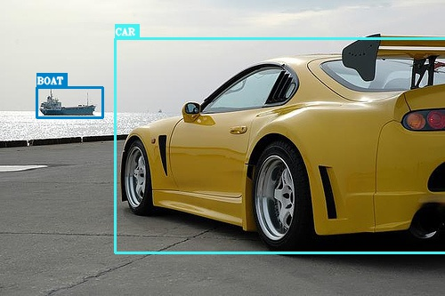

# SSD-Implementation-using-Pytorch

I would like to thank [Sagar Vinodababu] (https://github.com/sgrvinod/a-PyTorch-Tutorial-to-Object-Detection) for wonderful repoistory on implementing SSD300 using Pytorch.
Please check out his github Repo for detailed theory on SSD (Single Shot Detector).

**VGG-16 pre-trained model** is used here as Base model with few changes. On top of it auxillary Convolution layers are added to get Feature Maps of different size.

*Who doesn't love to train a machine to perform object detection!*

---

<p align="center">

</p>

---

<p align="center">

</p>

---
# Methodology
1) I have taken SSD 300 variant for this project (300x300 resolution). You can choose to go for SSD512 variant as well just that it is heavier.
2) This data contains images with twenty different types of objects.

```python
{'aeroplane', 'bicycle', 'bird', 'boat', 'bottle', 'bus', 'car', 'cat', 'chair', 'cow', 'diningtable', 'dog', 'horse', 'motorbike', 'person', 'pottedplant', 'sheep', 'sofa', 'train', 'tvmonitor'}
```
3) PASCAL VOC 2007+2012 dataset has been used here.
- [2012 _trainval_](http://host.robots.ox.ac.uk/pascal/VOC/voc2012/VOCtrainval_11-May-2012.tar) (2GB)
- [2007 _trainval_](http://host.robots.ox.ac.uk/pascal/VOC/voc2007/VOCtrainval_06-Nov-2007.tar) (460MB)
- [2007 _test_](http://host.robots.ox.ac.uk/pascal/VOC/voc2007/VOCtest_06-Nov-2007.tar) (451MB)

Make sure you extract both the VOC 2007 _trainval_ and 2007 _test_ data to the same location and merge them.Store it in **two folders 'VOC2007' and 'VOC2012'** with the code.

# Implemenation
1) Start with **train_lite.ipynb** Notebook with the training of the model which runs for 10 epochs at a time. (I just find it more convinient to run Notebook for training multiple times)
2) After each epoch, it will save the checkpoint as **'.pth.tar' file**.
3) Run **eval.py** once you feel like testing your model.
4) In the end, execute **demo.py** to see some real-time detections on set of images and video. You can experiment with min_score, max_overlap, and top_k based on your data and target size.

# Evaluation
I have trained the model for 100 epochs and i am getting the following **Mean Average Precision (mAP): 0.723**
Below are Avereage Precesion values for all classes:-

 | Class | Average Precision |
 | :-----: | :------: |
 | _aeroplane_ | 0.7508596181869507 |
 | _bicycle_ | 0.8064944744110107 |  
 | _bird_ | 0.7118245959281921 |     
 | _boat_ | 0.6522005200386047 |     
 | _bottle_ | 0.4388348162174225 |   
 | _bus_ | 0.8313817381858826 |      
 | _car_ | 0.8420098423957825 |      
 | _cat_ | 0.8460454344749451 |
 | _chair_ | 0.4887792468070984 |
 | _cow_ | 0.7463425993919373 |
 | _diningtable_ | 0.7300090789794922 |
 | _dog_ | 0.7909976243972778 |
 | _horse_ | 0.8242510557174683 |
 | _motorbike_ | 0.804941713809967 |
 | _person_ | 0.7624345421791077 |
 | _pottedplant_ | 0.4471535384654999 |
 | _sheep_ | 0.7205353379249573 |
 | _sofa_ | 0.7502992749214172 |
 | _train_ | 0.8156716823577881 |
 | _tvmonitor_ | 0.6981692910194397 |

# Reference
1. Original Paper on SSD- (https://raw.githubusercontent.com/sgrvinod/a-PyTorch-Tutorial-to-Object-Detection/master/README.md)
2. Github repo of sgrvinod- (https://github.com/sgrvinod/a-PyTorch-Tutorial-to-Object-Detection/blob/master/README.md)
